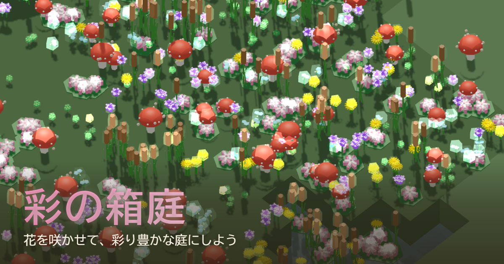

# 彩の箱庭

種を蒔いて花を育て、開花・収穫で色素を集め、色を配合したり盤面に直接塗ったりしながら、自分だけの庭を彩っていく箱庭ゲームです。

▶ **遊ぶ:** https://amagaki.github.io/irodori-hakoniwa/

<!-- スクリーンショット（公開前に差し替え） -->
<!--  -->

---

## 概要
盤面に種を植えて育てると花が咲き、色素が手に入ります。集めた色素は「配合」で組み合わせたり、「色塗り」で盤面の植物・地形・水に直接乗せたりできます。フェアリーリングや浮遊石など、庭を彩る飾りも設置できます。昼夜が移り変わる中で、自分だけの庭をのんびり育てていきましょう。

## 遊び方（基本）
1. **種植え**モードでマスに種を配置
2. 花が**開花・収穫**すると色素を獲得
3. **配合**で色の組み合わせを選ぶ、**色塗り**で盤面に直接色を乗せる
4. **ショップ**で飾りを購入して庭を彩る

## 操作
- **マウス**：種植え・収穫・色塗り等の各種操作
- **WASD**：視点移動／**ホイール**：ズーム／**Q, E**：回転／**Space**：一時停止・再生
- 推奨環境：PC（キーボード＋マウス）／デスクトップ版 Chrome・Firefox（モバイル非対応）

---

## クレジット
- **ライブラリ**：[three.js](https://threejs.org/)（MIT）／TypeScript・Vite

## ライセンス
本作は **CC BY-NC-ND 4.0**（表示 - 非営利 - 改変禁止）で公開しています。
**無断での商用利用・改変・再配布、および AI 学習（データセット利用）を一切禁止**します。
詳細は [LICENSE.md](LICENSE.md) を参照してください。

> 「成果物の公開」は「改変・二次創作の自由」を意味しません。プレイ・体験は歓迎しますが、改変・商用利用・AI 学習は固くお断りします。

---

Copyright © 2026 amagaki. All rights reserved.
